## Abstract

Two alternatives to right censoring are left censoring (you only know that the event occurred before a particular time) and interval censoring (you only know that the event occured sometime in a particular time interval). You will see examples of both types of censoring as well as left truncation. 

## Abstract (continued)

You can incorporate mutliple events per patient and account for center effects using frailty models, the survival data analysis equivalent to mixed models in linear regression. You’ll see how to define random effects and how to fit and interpret these models.

## Ignore this slide.

```{r load-libraries, echo=FALSE}
library(broom, warn.conflict=FALSE)
library(coxme, quietly=TRUE, warn.conflict=FALSE)
library(dplyr, warn.conflict=FALSE)
library(ggplot2, warn.conflict=FALSE)
library(magrittr, warn.conflict=FALSE)
library(survival, warn.conflict=FALSE)
library(tidyr, warn.conflict=FALSE)
knitr::opts_chunk$set(
  echo=FALSE,
  fig.width=4.5,
  fig.height=2.5)

```

## Interval censored data

An event is said to be interval censored in the interval (a,b) if you know that the event did not occur before time a and that it did occur before time b.

* A right censored observation is equivalent to interval censoring on the interval (a, $\infty$).

* A left censored observation is equivalent to interval censoring on the interval (0, b).

## Example of left censored data

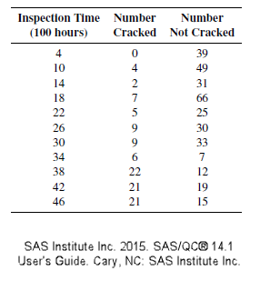

## Example of interval censored data

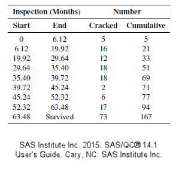

## Brief explanation of analysis

The likelihood in most settings is the product of the density functions, but with left censoring, you replace the density by

$\int_0^b f(t; \beta) = 1-S(b; \beta)$

with interval censoring, you replace the density by

$\int_a^b f(t; \beta) = S(a; \beta)-S(b; \beta)$

## Exponential likelihood for left/right censoring

$L(\lambda)=$

$(1-e^{-4\lambda})^0(e^{-4\lambda})^{39}$

$(1-e^{-10\lambda})^4(e^{-10\lambda})^{49}$

$(1-e^{-14\lambda})^2(e^{-14\lambda})^{31}$

$...$

## Model results for left censored data (1 of 4)

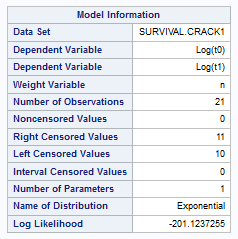

## Model results for left censored data (2 of 4)

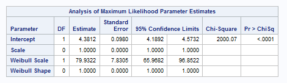

## Model results for left censored data (3 of 4)

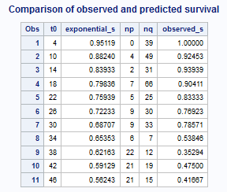

## Model results for left censored data (4 of 4)

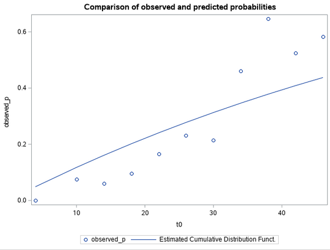

## Exponential likelihood for interval censoring

$L(\lambda)=$

$(1-e^{-6.12\lambda})^5$

$(e^{-6.12\lambda}-e^{-19.92\lambda})^{16}$

$(e^{-19.92\lambda}-e^{-29.64\lambda})^{12}$

$(e^{-29.64\lambda}-e^{-35.40\lambda})^{18}$

$...$

## Model results for interval censored data (1 of 4)

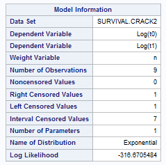

## Model results for interval censored data (2 of 4)

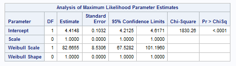

## Model results for interval censored data (3 of 4)

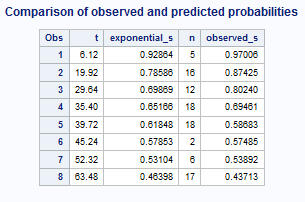

## Model results for interval censored data (4 of 4)

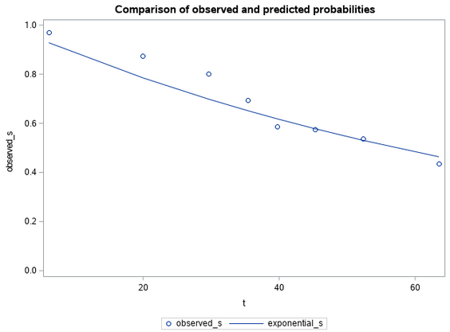

## Left truncation

In most studies, patients are considered part of the risk set from time 0 to the time that they either die or are censored. But sometimes patients start contributing information about survival only from a certain point forward. This is left truncation.

## Example: Mortality in an inpatient psych unit

```{r psychiatric}
fn <- "../../data/psychiatric patients.csv"
psychiatric <- read.csv(fn, header=TRUE)
head(psychiatric)
```

math.usu.edu/jrstevens/biostat/projects2013/pres_LeftTruncation.pdf

## Plot of entry/exit for each patient

```{r plot-psych}
par(mar=c(2.6, 2.6, 0.6, 0.6), las=1)
psychiatric$age2 <- psychiatric$age+psychiatric$time
psychiatric %<>% arrange(age, age2)
n <- dim(psychiatric)[1]
n_atrisk <- rep(NA, 80)
for (i in 1:80) {
  n_atrisk[i] <- sum((psychiatric$age<=i) - (psychiatric$age2<=i))
}
plot(c(0, 80), c(1,n), type="n")
segments(psychiatric$age, 1:n, psychiatric$age2, 1:n)
```

## Changes in number at risk

```{r n_atrisk}
par(mar=c(2.6, 2.6, 0.6, 0.6), las=1)
plot(1:80, n_atrisk, type="s", ylim=c(0,25))
```

## Kaplan-Meier survival estimates

```{r km}
par(mar=c(2.6, 2.6, 0.6, 0.6), las=1)
psychiatric              %$%
  Surv(age, age2, death) -> psychiatric_surv
survfit(psychiatric_surv~psychiatric$sex)    %>%
  tidy                                       -> 
psychiatric_km
m <- psychiatric_km$strata=="psychiatric$sex=1"
f <- psychiatric_km$strata=="psychiatric$sex=2"

# Males are the red line, females black.
plot(c(0, 80), c(0, 1), type="n")
lines(
  psychiatric_km$time[f],
  psychiatric_km$estimate[f], 
  type="s")
lines(
  psychiatric_km$time[m], 
  psychiatric_km$estimate[m], 
  type="s", col="red")
```

## Sandwich estimate

You can account for cluster effects by modifying the variance-covariance of the coefficients. For the normal model without frailty effects, the information matrix is

$I(\beta) = \frac{\partial^2 L_p}{(\partial \beta)^2}$

and the estimated variance covariance matrix, $\hat{V}$, is

$\hat{V} = I(\hat{\beta})^{-1}$

## Sandwich

The robust sandwich estimator (similar to the sandwich estimator in Generalized Estimating Equations) is

$\hat{R} = \hat{V} (\hat{L}'\hat{L}) \hat{V}$

where $\hat{L}$ is the vector of Schoenfeld residuals. The middle of this sandwich, the $\hat{L}'\hat{L}$, adjusts the variance covariance matrix to account for the correlation within clusters.

## Frailty model

Recall that the proportional hazards model assumes that the hazard function of a given patient,

$h(t, X, \beta) = h_0(t) e^{X \beta}$

The frailty model multiplies all the hazards within a family f by a frailty term $z_f$.

$h(t, X, \beta) = z_f h_0(t) e^{X \beta}$

Typically, $z_f$ is given a gamma distribution with a mean of 1 and a variance of $\frac{1}{\alpha}$.

## Gamma distribution, alpha=50

```{r graph-gamma-50}
par(mar=c(2.6, 2.6, 0.6, 0.6))
alpha <- 50
x <- seq(0.001, 4, length=1000)
plot(x, dgamma(x, alpha, rate=alpha), 
  type="l", xlim=c(0, 4), ylim=c(0,3))
qg <- qgamma(c(0.25, 0.75), alpha, rate=alpha)
segments(qg, 0, qg, 2.5)
text(qg, 2.75, round(qg, 2))
```

## Gamma distribution, alpha=10

```{r graph-gamma}
par(mar=c(2.6, 2.6, 0.6, 0.6))
alpha <- 10
x <- seq(0.001, 4, length=1000)
plot(x, dgamma(x, alpha, rate=alpha), 
  type="l", xlim=c(0, 4), ylim=c(0, 3))
qg <- qgamma(c(0.25, 0.75), alpha, rate=alpha)
segments(qg, 0, qg, 2.5)
text(qg, 2.75, round(qg, 2))
```

## Gamma distribution: alpha=5

```{r gamma-5}
alpha <- 5
par(mar=c(2.6, 2.6, 0.6, 0.6))
plot(x, dgamma(x, alpha, rate=alpha), 
  type="l", xlim=c(0, 4), ylim=c(0, 3))
qg <- qgamma(c(0.25, 0.75), alpha, rate=alpha)
segments(qg, 0, qg, 2.5)
text(qg, 2.75, round(qg, 2))
```

## Gamma distribution: alpha=2

```{r gamma-2}
alpha <- 2
par(mar=c(2.6, 2.6, 0.6, 0.6))
plot(x, dgamma(x, alpha, rate=alpha), 
  type="l", xlim=c(0, 4), ylim=c(0, 3))
qg <- qgamma(c(0.25, 0.75), alpha, rate=alpha)
segments(qg, 0, qg, 2.5)
text(qg, 2.75, round(qg, 2))
```

## Partial listing of rats data

```{r rats}
# This data set is found in the survival package.
head(rats)
```

## Descriptive statistics for rats data

```{r graph-rats}
table(rats$rx)
table(rats$status)
table(rats$sex)
summary(rats$time)
```

## Overall survival

```{r rats-overall}
par(mar=c(2.6, 2.6, 0.6, 0.6))
rats_surv <- Surv(rats$time, rats$status)
overall_km <- survfit(rats_surv~1)
overall_km %>%
  tidy                                     %>%
  ggplot(aes(time, estimate)) +
    geom_step()
```

## Survival by treatment

```{r unadjusted-rx}
par(mar=c(2.6, 2.6, 0.6, 0.6))
survfit(rats_surv~rx, data=rats)           %>%
  tidy                                     %>%
  ggplot(aes(time, estimate, color=strata)) +
    geom_step()
```

## Survival by sex

```{r unadjusted-sex}
par(mar=c(2.6, 2.6, 0.6, 0.6))
survfit(rats_surv~sex, data=rats)          %>%
  tidy                                     %>%
  ggplot(aes(time, estimate, color=strata)) +
    geom_step()
```

## Cluster effect

```{r rats-cluster}
rats_cluster <- coxph(
  rats_surv~rx+cluster(litter),
  data=rats,
  subset=(sex=="f"))
```

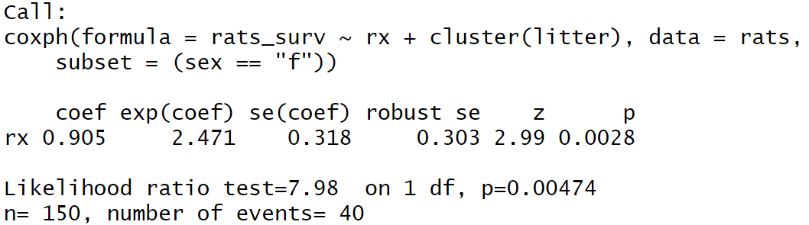

## Frailty effect

```{r rats-frailty}
rats_random <- coxph(
  rats_surv~rx+frailty(litter),
  data=rats,
  subset=(sex=="f"))
```

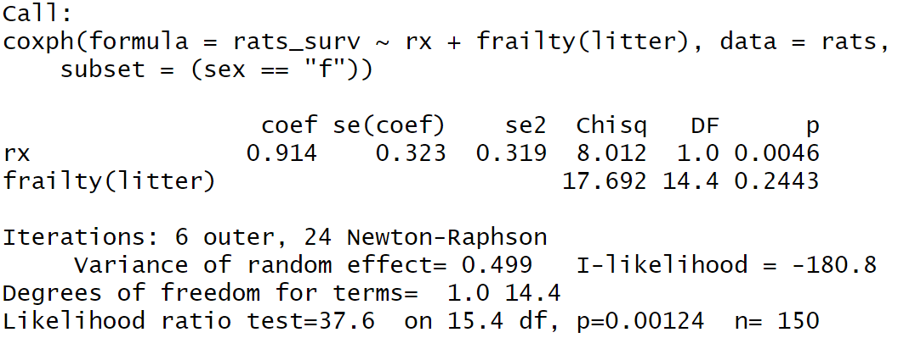


## Three models

When you have two or more events occurring on a single patient, you have three different options for analyzing the data. It all depends on what the clock restarts at after the first event.

## Graphical display of three models

```{r three-models}
# kidney is a data set found in the survival library.
kidney2 <- kidney
kidney2$s <- kidney2$status
par(mar=c(2.6, 2.6, 0.6, 0.6))
plot_sequence <- function(i) {
  c1 <- "darkred"
  c2 <- "darkgreen"
  kidney2$lb <- ifelse(kidney2$status==1, "D", "C")
  kidney2                %>%
    filter(id==i)        %>%
    filter(s==1)         %>%
    select(time, lb)     -> t1
  kidney2                %>%
    filter(id==i)        %>%
    filter(s==2)         %>%
    select(time, lb)     -> t2
  t2$time <- ifelse(t1$lb=="C", NA, t2$time)
  tmax <- sum(t1$time,t2$time, na.rm=TRUE)
  plot(c(0, 1.4*tmax), c(10, 50), type="n", axes=FALSE)
  axis(side=1, at=c(0, t1$time, t2$time, tmax))
  segments(0, 50, t1$time, 50, col=c1)
  segments(t1$time, 50, tmax, 50, col=c2)
  text(t1$time, 50, t1$lb, col=c1)
  text(tmax,    50, t2$lb, col=c2)
  text(1.2*tmax, 45, "start", adj=1)
  text(1.4*tmax, 45, "stop", adj=1)

  segments(0, 40, t1$time, 40, col=c1)
  segments(0, 36, t2$time, 36, col=c2)
  text(t1$time, 40, t1$lb, col=c1)
  text(t2$time, 36, t2$lb, col=c2)
  text(1.2*tmax, 40, 0, col=c1, adj=1)
  text(1.4*tmax, 40, t1$time, col=c1, adj=1)
  text(1.2*tmax, 36, 0, col=c2, adj=1)
  text(1.4*tmax, 36, t2$time, col=c2, adj=1)
  
  segments(0, 30, t1$time, 30, col=c1)
  segments(t1$time, 26, tmax, 26, col=c2)
  text(t1$time, 30, t1$lb, col=c1)
  text(tmax, 26, t2$lb, col=c2)
  text(1.2*tmax, 30, 0, col=c1, adj=1)
  text(1.4*tmax, 30, t1$time, col=c1, adj=1)
  text(1.2*tmax, 26, t1$time, col=c2, adj=1)
  text(1.4*tmax, 26, tmax, col=c2, adj=1)

  segments(0, 20, t1$time, 20, col=c1)
  segments(0, 16, tmax, 16, col=c2)
  text(t1$time, 20, t1$lb, col=c1)
  text(tmax, 16, t2$lb, col=c2)
  text(1.2*tmax, 20, 0, col=c1, adj=1)
  text(1.4*tmax, 20, t1$time, col=c1, adj=1)
  text(1.2*tmax, 16, 0, col=c2, adj=1)
  text(1.4*tmax, 16, tmax, col=c2, adj=1)
}
# plot_sequence(30)
```

Save everything for possible later re-use.

```{r save-everything}
save.image("../../data/class7.RData")
```